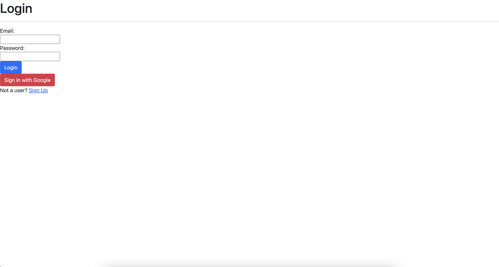

# React app with Firebase Authentication

This project was bootstrapped with [Create React App](https://github.com/facebook/create-react-app).

## Run Scripts
To run the project, use `npm run start`

### Note
Credentials file not needed

For more info on Authentication, see the [Firebase docs](https://firebase.google.com/docs/auth). 

